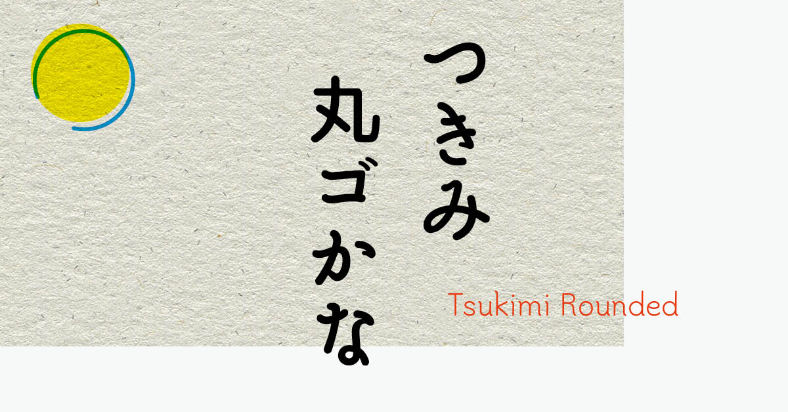

つきみ丸ゴかな 
5ウェイト、L/R/M/DB/B 

Tsukimi Rounded 
5weight, Light/Regular/Medium/SemiBold/Bold

<h2>はじめに</h2>
「つきみ丸ゴかな」は、東京築地活版製造所の3号かなの骨格を参考にしたかな書体です。
筆の動きを残した丸ゴシックで、縦組みに向く骨格です。

Tsukimi Rounded is kana font that is based san-go(Japanese traditional go-number sized type, #3) in Tsukiji Type Foundry’s specimen books.
Original san-go type is Mincho style but Tsukimi Rounded is sans-serif typeface with rounded terminals.

<h2>SIL Open Font License Version 1.1ライセンスについて</h2>

・個人利用・商用利用にかかわらずどなたでも無料でお使いいただけます。 

・ゲームやアプリなどへの組み込みやwebフォントとしての利用も可能です。 

・このフォントを使用し、派生フォントを作ることもできます。 
　ただし、配布の際はSIL Open Font Licenseに基づいてリリースする必要があります。 

・SILライセンスについて詳しくはライセンス原文日本語サイト 
　（https://ja.osdn.net/projects/opensource/wiki/SIL_Open_Font_License_1.1） 
　または同梱の「OFL.txt」（英語）をご確認ください。 

<h2>収録文字</h2>
・latin_unique-glyphs.namファイルにリストされている215個のグリフ 
・ひらがな（108）、カタカナ（101）、一部全角記号 
・合計530グリフ

<h2>できないこと</h2>
・「SIL Open Font License Version 1.1」以外のライセンスで再配布すること。 
・フォントファイル自体を単体で販売すること。 
